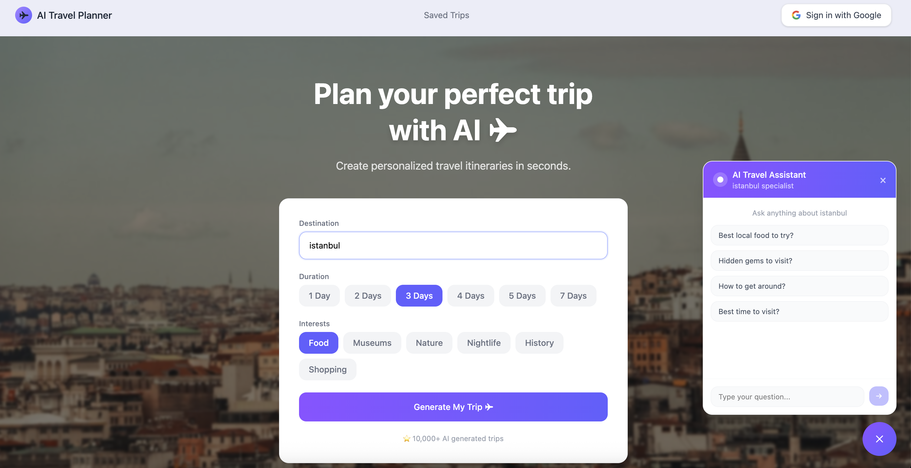

# ✈ AI Travel Planner

A full-stack AI-powered travel itinerary generator. Enter a city, select your interests, and get a personalized day-by-day travel plan with an interactive map, weather forecast, and a built-in travel assistant.

**Live demo:** [your-app.vercel.app](https://travel-planner-kappa-ten.vercel.app)



---

## Features

- **AI Itinerary Generation** — Generates personalized day-by-day travel plans using Groq's LLM API
- **Interactive Map** — Leaflet.js + OpenStreetMap renders each activity location with custom markers
- **Weather Forecast** — 7-day weather data from Open-Meteo (no API key required)
- **City Photography** — Dynamic hero backgrounds powered by Unsplash API
- **AI Travel Assistant** — Fixed chat bubble for real-time travel questions about your destination
- **Save & Manage Trips** — Authenticated users can save, view, and delete itineraries via Supabase
- **Google Auth** — One-click sign-in with Google OAuth via Supabase Auth

---

## Tech Stack

### Frontend

| Technology                                                                           | Purpose                                    |
| ------------------------------------------------------------------------------------ | ------------------------------------------ |
| [Next.js 14](https://nextjs.org)                                                     | Full-stack React framework with App Router |
| [TypeScript](https://www.typescriptlang.org)                                         | Type safety across the entire codebase     |
| [Tailwind CSS](https://tailwindcss.com)                                              | Utility-first styling                      |
| [Leaflet.js](https://leafletjs.com) + [OpenStreetMap](https://www.openstreetmap.org) | Interactive maps, free & open source       |

### AI & APIs

| Service                                         | Purpose                                   | Cost                    |
| ----------------------------------------------- | ----------------------------------------- | ----------------------- |
| [Groq API](https://console.groq.com)            | LLM inference — `llama-3.3-70b-versatile` | Free tier               |
| [Open-Meteo](https://open-meteo.com)            | Weather forecast + geocoding              | Completely free         |
| [Unsplash API](https://unsplash.com/developers) | City photography                          | Free tier (50 req/hour) |

### Backend & Auth

| Service                                    | Purpose                                  | Cost      |
| ------------------------------------------ | ---------------------------------------- | --------- |
| [Supabase](https://supabase.com)           | PostgreSQL database + Row Level Security | Free tier |
| [Supabase Auth](https://supabase.com/auth) | Google OAuth authentication              | Free tier |
| Next.js API Routes                         | Server-side API endpoints                | —         |

### Deployment

| Service                      | Purpose                    |
| ---------------------------- | -------------------------- |
| [Vercel](https://vercel.com) | Hosting + CI/CD via GitHub |
| [GitHub](https://github.com) | Version control            |

---

## Project Structure

```
src/
├── app/
│   ├── api/
│   │   ├── generate-trip/route.ts   # Groq itinerary generation
│   │   ├── chat/route.ts            # Groq travel assistant chat
│   │   └── city-photo/route.ts      # Unsplash city photography
│   ├── auth/callback/route.ts       # Supabase OAuth callback
│   ├── saved-trips/page.tsx         # Saved trips page
│   ├── page.tsx                     # Home page
│   └── layout.tsx
├── components/
│   ├── PlannerPanel.tsx             # Main form + state management
│   ├── ItineraryPanel.tsx           # Day-by-day itinerary view
│   ├── MapPanel.tsx                 # Leaflet map with markers
│   ├── WeatherStrip.tsx             # Weather forecast strip
│   ├── ChatBubble.tsx               # Fixed AI chat assistant
│   └── AuthButton.tsx               # Google sign-in button
├── hooks/
│   ├── useAuth.ts                   # Supabase auth state
│   ├── useSavedTrips.ts             # CRUD operations for trips
│   ├── useCityPhoto.ts              # Unsplash photo fetching
│   └── useWeather.ts                # Open-Meteo weather data
├── lib/
│   └── supabase.ts                  # Supabase browser client
└── types/
    └── trip.ts                      # TypeScript interfaces
```

---

## Getting Started

### Prerequisites

- Node.js 18+
- A [Groq](https://console.groq.com) account (free)
- A [Supabase](https://supabase.com) project (free)
- An [Unsplash](https://unsplash.com/developers) developer account (free)

### Installation

**1 — Clone the repo:**

```bash
git clone https://github.com/your-username/ai-travel-planner.git
cd ai-travel-planner
npm install
```

**2 — Set up environment variables:**

Create a `.env.local` file in the root:

```env
GROQ_API_KEY=gsk_xxxxxxxxxxxxxxxx
NEXT_PUBLIC_SUPABASE_URL=https://xxxxx.supabase.co
NEXT_PUBLIC_SUPABASE_ANON_KEY=eyJxxx...
NEXT_PUBLIC_UNSPLASH_ACCESS_KEY=xxxxxxxxxxxxxxxx
```

**3 — Set up Supabase database:**

Run this SQL in your Supabase SQL Editor:

```sql
create table saved_trips (
  id uuid default gen_random_uuid() primary key,
  user_id uuid references auth.users(id) on delete cascade not null,
  city text not null,
  days integer not null,
  interests text[] not null,
  itinerary jsonb not null,
  created_at timestamp with time zone default now()
);

alter table saved_trips enable row level security;

create policy "Users can view own trips"
  on saved_trips for select
  using (auth.uid() = user_id);

create policy "Users can insert own trips"
  on saved_trips for insert
  with check (auth.uid() = user_id);

create policy "Users can delete own trips"
  on saved_trips for delete
  using (auth.uid() = user_id);
```

**4 — Run the development server:**

```bash
npm run dev
```

Open [http://localhost:3000](http://localhost:3000).

---

## Deployment

This project is deployed on Vercel with automatic CI/CD via GitHub.

**1 — Push to GitHub:**

```bash
git add .
git commit -m "initial commit"
git push origin main
```

**2 — Import to Vercel:**

Go to [vercel.com](https://vercel.com) → Add New Project → Import your repo → Add all environment variables → Deploy.

**3 — Configure Supabase for production:**

In Supabase → Authentication → URL Configuration:

- Site URL: `https://your-app.vercel.app`
- Redirect URLs: `https://your-app.vercel.app/auth/callback`

---

## Environment Variables

| Variable                          | Description                                | Required |
| --------------------------------- | ------------------------------------------ | -------- |
| `GROQ_API_KEY`                    | Groq API key for LLM inference             | Yes      |
| `NEXT_PUBLIC_SUPABASE_URL`        | Supabase project URL                       | Yes      |
| `NEXT_PUBLIC_SUPABASE_ANON_KEY`   | Supabase anonymous key (safe for frontend) | Yes      |
| `NEXT_PUBLIC_UNSPLASH_ACCESS_KEY` | Unsplash API access key                    | Yes      |

---
